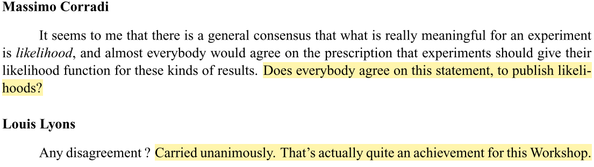
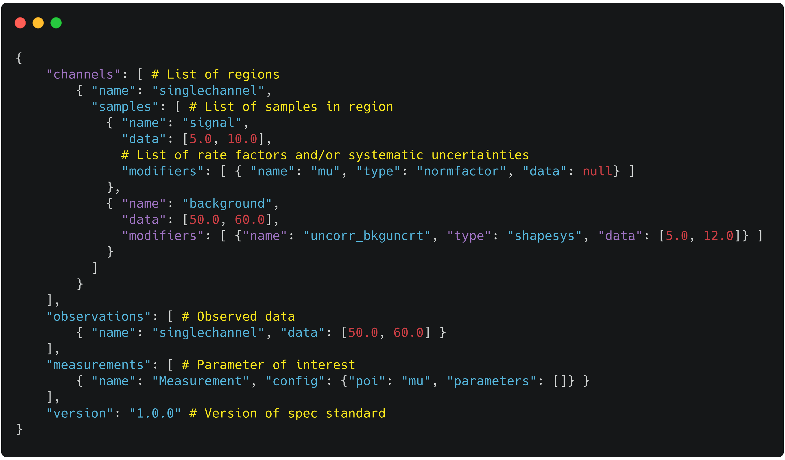
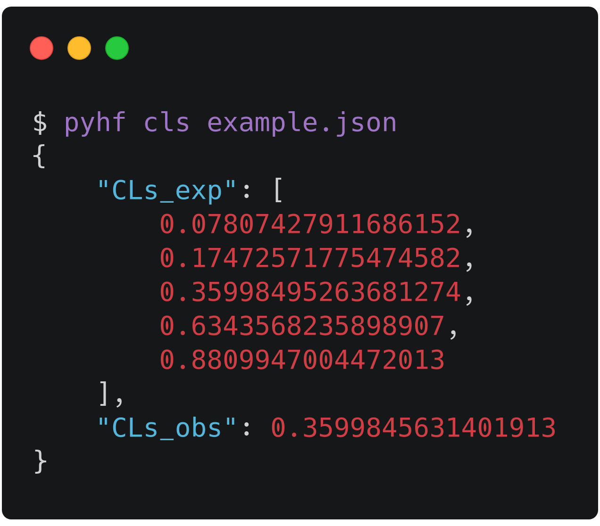
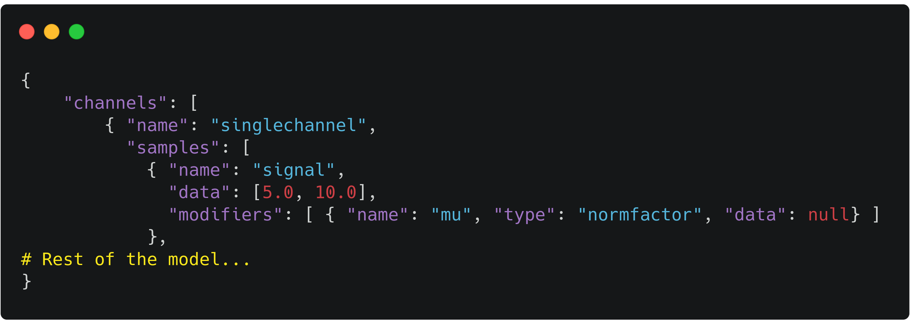
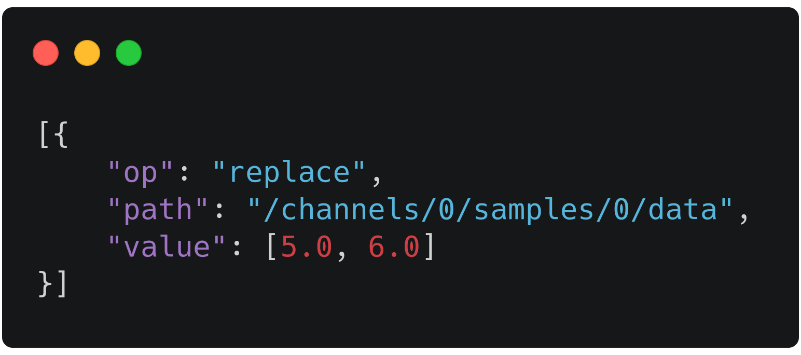
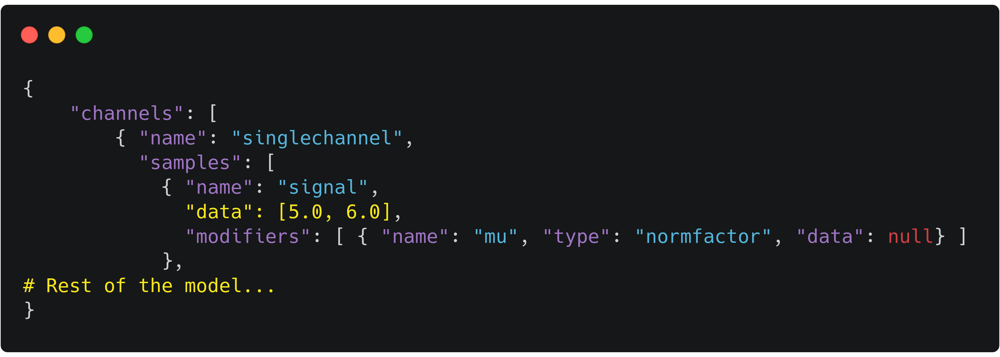
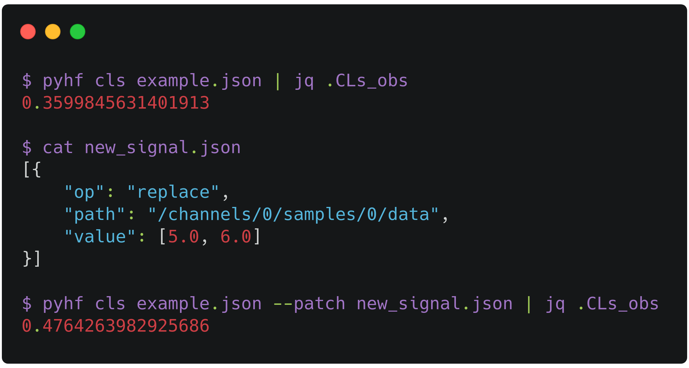
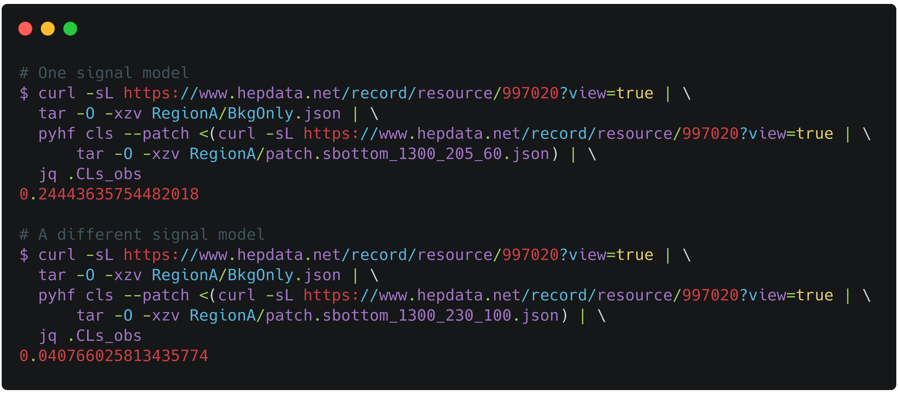
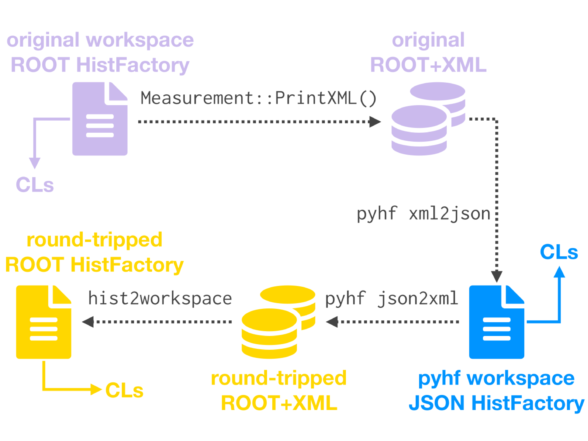
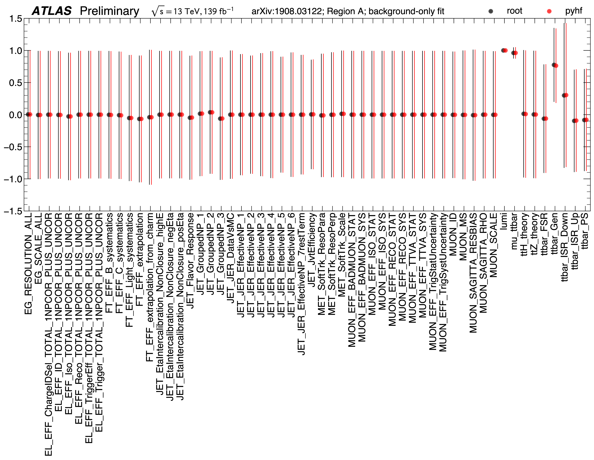

class: middle, center, title-slide
count: false

# `pyhf`: pure-Python
# implementation of HistFactory
<br>

(for the dev team)<br>
Matthew Feickert<br>
[matthew.feickert@cern.ch](mailto:matthew.feickert@cern.ch)

[PyHEP 2019](https://indico.cern.ch/event/833895/contributions/3577824/)

October 18th, 2019

---
# pyhf team

<br><br>

.grid[
.kol-1-4.center[
.circle.width-80[]

[Lukas Heinrich](https://github.com/lukasheinrich)

CERN
]
.kol-1-4.center[
.circle.width-80[]

[Matthew Feickert](https://www.matthewfeickert.com/)

Illinois
]
.kol-1-4.center[
.circle.width-80[]

[Giordon Stark](https://github.com/kratsg)

UCSC SCIPP
]
.kol-1-4.center[
.circle.width-70[]

[Kyle Cranmer](http://theoryandpractice.org/)

NYU
]
]

.kol-3-4.center.bold[Core Developers]
.kol-1-4.center.bold[Advising]

---
# Why is the likelihood important?

<br>

.kol-1-2.width-90[
- High information-density summary of analysis
- Almost everything we do in the analysis ultimately affects the likelihood and is encapsulated in it
   - Trigger
   - Detector
   - Systematic Uncertainties
   - Event Selection
- Unique representation of the analysis to preserve
]
.kol-1-2.width-90[
<br><br><br>
[](https://indico.cern.ch/event/839382/contributions/3521168/)
]

---
# Likelihood serialization...

.center[...making good on [19 year old agreement to publish likelihoods](https://indico.cern.ch/event/746178/contributions/3396797/)]

<br>

.center.width-100[
[](https://cds.cern.ch/record/411537)
]

.center[([1st Workshop on Confidence Limits, CERN, 2000](http://inspirehep.net/record/534129))]

.bold[This hadn't been done in HEP until now]
- In an "open world" of statistics this is a difficult problem to solve
- What to preserve and how? All of ROOT?
- Idea: Focus on a single more tractable binned model first

---
# Enter HistFactory

<br>

- A flexible p.d.f. template to build statistical models from binned distributions and data
- Developed by Cranmer, Lewis, Moneta, Shibata, and Verkerke [1]
- Widely used by the HEP community for standard model measurements and BSM searches
   <!-- - Show public summary plots and link to references that use HistFactory (multi b-jets for example) -->

.kol-1-1.center[
.width-100[]
]

---
# HistFactory Template

$$
f\left(\vec{n}, \vec{a}\middle|\vec{\eta}, \vec{\chi}\right) = \color{blue}{\prod\_{c \\,\in\\, \textrm{channels}} \prod\_{b \\,\in\\, \textrm{bins}\_c} \textrm{Pois} \left(n\_{cb} \middle| \nu\_{cb}\left(\vec{\eta}, \vec{\chi}\right)\right)} \\,\color{red}{\prod\_{\chi \\,\in\\, \vec{\chi}} c\_{\chi} \left(a\_{\chi}\middle|\chi\right)}
$$

$$
\nu\_{cb}(\vec{\eta}, \vec{\chi}) = \sum\_{s \\,\in\\, \textrm{samples}} \underbrace{\left(\sum\_{\kappa \\,\in\\, \vec{\kappa}} \kappa\_{scb}(\vec{\eta}, \vec{\chi})\right)}\_{\textrm{multiplicative}} \Bigg(\nu\_{scb}^{0}(\vec{\eta}, \vec{\chi}) + \underbrace{\sum\_{\Delta \\,\in\\, \vec{\Delta}} \Delta\_{scb}(\vec{\eta}, \vec{\chi})}\_{\textrm{additive}}\Bigg)
$$

.bold[Use:] Multiple disjoint _channels_ (or regions) of binned distributions with multiple _samples_ contributing to each with additional (possibly shared) systematics between sample estimates

.bold[Main pieces:]
- .blue[Main Poisson p.d.f. for simultaneous measurement of multiple channels]
- .katex[Event rates] $\nu\_{cb}$ from nominal rate $\nu\_{scb}^{0}$ and rate modifiers $\kappa$ and $\Delta$
- .red[Constraint p.d.f. (+ data) for "auxiliary measurements"]
   - encoding systematic uncertainties (normalization, shape, etc)
- $\vec{n}$: events, $\vec{a}$: auxiliary data, $\vec{\eta}$: unconstrained pars, $\vec{\chi}$: constrained pars

---
# HistFactory Template

$$
f\left(\vec{n}, \vec{a}\middle|\vec{\eta}, \vec{\chi}\right) = \prod\_{c \\,\in\\, \textrm{channels}} \prod\_{b \\,\in\\, \textrm{bins}\_c} \textrm{Pois} \left(n\_{cb} \middle| \nu\_{cb}\left(\vec{\eta}, \vec{\chi}\right)\right) \prod\_{\chi \\,\in\\, \vec{\chi}} c\_{\chi} \left(a\_{\chi}\middle|\chi\right)
$$
<br>

.bold[This is a _mathematical_ representation!] Nowhere is any software spec defined

Until now, the only implementation of HistFactory has been in RooStats+RooFit

<br>

- Preservation: Likelihood stored in the binary ROOT format
   - Challenge for long-term preservation (i.e. HEPData)
   - Why is a histogram needed for an array of numbers?
- To start using HistFactory p.d.f.s first have to learn ROOT, RooFit, RooStats
   - Problem for our theory colleagues (generally don't want to)
- Difficult to use for reinterpretation

---
# `pyhf`: HistFactory in pure Python
<!--  -->
.kol-1-2.width-95[
- First non-ROOT implementation of the HistFactory p.d.f. template
   - [](https://doi.org/10.5281/zenodo.1169739)
- pure-Python library as second implementation of HistFactory
  - [`pip install pyhf`](https://diana-hep.org/pyhf/installation.html#install-from-pypi)
  - No dependence on ROOT!
]
.kol-1-2.center.width-90[
[](https://diana-hep.org/pyhf/)
]
<!--  -->
.kol-1-1[
- Has a JSON spec that .blue[fully] describes the HistFactory model
   - JSON: Industry standard, parsable by every language, human & machine readable, versionable and easily preserved (HEPData is JSON)
- Open source tool for all of HEP
   - Originated from a [DIANA/HEP](https://diana-hep.org/) project fellowship and now an [IRIS-HEP](https://iris-hep.org/projects/pyhf.html) supported project
   - Used for reinterpretation in phenomenology paper [2]
   - Used internally in ATLAS for pMSSM SUSY large scale reinterpretation
]

---
# Example pyhf JSON spec

<a href="https://carbon.now.sh/?bg=rgba(255%2C255%2C255%2C1)&t=seti&wt=none&l=application%2Fjson&ds=false&dsyoff=20px&dsblur=68px&wc=true&wa=true&pv=3px&ph=1px&ln=false&fl=1&fm=Hack&fs=14px&lh=133%25&si=false&es=4x&wm=false&code=%257B%250A%2520%2520%2520%2520%2522channels%2522%253A%2520%255B%2520%2523%2520List%2520of%2520regions%250A%2520%2520%2520%2520%2520%2520%2520%2520%257B%2520%2522name%2522%253A%2520%2522singlechannel%2522%252C%250A%2520%2520%2520%2520%2520%2520%2520%2520%2520%2520%2522samples%2522%253A%2520%255B%2520%2523%2520List%2520of%2520samples%2520in%2520region%250A%2520%2520%2520%2520%2520%2520%2520%2520%2520%2520%2520%2520%257B%2520%2522name%2522%253A%2520%2522signal%2522%252C%250A%2520%2520%2520%2520%2520%2520%2520%2520%2520%2520%2520%2520%2520%2520%2522data%2522%253A%2520%255B5.0%252C%252010.0%255D%252C%250A%2520%2520%2520%2520%2520%2520%2520%2520%2520%2520%2520%2520%2520%2520%2523%2520List%2520of%2520rate%2520factors%2520and%252For%2520systematic%2520uncertainties%250A%2520%2520%2520%2520%2520%2520%2520%2520%2520%2520%2520%2520%2520%2520%2522modifiers%2522%253A%2520%255B%2520%257B%2520%2522name%2522%253A%2520%2522mu%2522%252C%2520%2522type%2522%253A%2520%2522normfactor%2522%252C%2520%2522data%2522%253A%2520null%257D%2520%255D%250A%2520%2520%2520%2520%2520%2520%2520%2520%2520%2520%2520%2520%257D%252C%250A%2520%2520%2520%2520%2520%2520%2520%2520%2520%2520%2520%2520%257B%2520%2522name%2522%253A%2520%2522background%2522%252C%250A%2520%2520%2520%2520%2520%2520%2520%2520%2520%2520%2520%2520%2520%2520%2522data%2522%253A%2520%255B50.0%252C%252060.0%255D%252C%250A%2520%2520%2520%2520%2520%2520%2520%2520%2520%2520%2520%2520%2520%2520%2522modifiers%2522%253A%2520%255B%2520%257B%2522name%2522%253A%2520%2522uncorr_bkguncrt%2522%252C%2520%2522type%2522%253A%2520%2522shapesys%2522%252C%2520%2522data%2522%253A%2520%255B5.0%252C%252012.0%255D%257D%2520%255D%250A%2520%2520%2520%2520%2520%2520%2520%2520%2520%2520%2520%2520%257D%250A%2520%2520%2520%2520%2520%2520%2520%2520%2520%2520%255D%250A%2520%2520%2520%2520%2520%2520%2520%2520%257D%250A%2520%2520%2520%2520%255D%252C%250A%2520%2520%2520%2520%2522observations%2522%253A%2520%255B%2520%2523%2520Observed%2520data%250A%2520%2520%2520%2520%2520%2520%2520%2520%257B%2520%2522name%2522%253A%2520%2522singlechannel%2522%252C%2520%2522data%2522%253A%2520%255B50.0%252C%252060.0%255D%2520%257D%250A%2520%2520%2520%2520%255D%252C%250A%2520%2520%2520%2520%2522measurements%2522%253A%2520%255B%2520%2523%2520Parameter%2520of%2520interest%250A%2520%2520%2520%2520%2520%2520%2520%2520%257B%2520%2522name%2522%253A%2520%2522Measurement%2522%252C%2520%2522config%2522%253A%2520%257B%2522poi%2522%253A%2520%2522mu%2522%252C%2520%2522parameters%2522%253A%2520%255B%255D%257D%2520%257D%250A%2520%2520%2520%2520%255D%252C%250A%2520%2520%2520%2520%2522version%2522%253A%2520%25221.0.0%2522%2520%2523%2520Version%2520of%2520spec%2520standard%250A%257D">`JSON` defining a single channel, two bin counting experiment with systematics</a>

.center.width-100[]

---
# $CL_{s}$ Example using `pyhf` CLI

.center.width-80[]

<!-- --- -->
<!-- # Lukas note -->
<!--  -->
<!-- - Change the model to give more interesting CLs values -->
<!-- - c.f. slide 18 from Lukas Higgs Combination talk -->

---
# JSON Patch for new signal models
<!--  -->
.kol-1-2[
<br>
.center.width-100[]
.center[Original model]
]
.kol-1-2[
<!-- <br> -->
.center.width-100[]
.center[New Signal (JSON Patch file)]
]
.kol-1-1[
.center.width-80[]
.center[Reinterpretation]
]

---
# JSON Patch for new signal models
<!--  -->
.center.width-80[]
.kol-1-2[
.center.width-70[]
.center[Original analysis (model A)]
]
.kol-1-2[
.center.width-70[]
.center[Recast analysis (model B)]
]

---
# Likelihoods preserved on HEPData

- Background-only model JSON stored
- Signal models stored as JSON Patch files
- Together are able to fully preserve the full model

[.center.width-90[]](https://www.hepdata.net/record/ins1748602)

.footnote[Updated on 2019-10-21]

---
# ...can be streamed from HEPData

- Background-only model JSON stored
- Signal models stored as JSON Patch files
- Together are able to fully preserve the full model

.center.width-100[]

.footnote[Updated on 2019-10-21]

---
# ROOT + XML to JSON and back

.center.width-100[]

---
# Likelihood serialization and reproduction
<!--  -->
- ATLAS PUB note on the JSON schema for serialization and reproduction of results ([ATL-PHYS-PUB-2019-029](https://cds.cern.ch/record/2684863))
   - Contours: .root[█] original ROOT+XML, .pyhf[█] pyhf JSON, .roundtrip[█] JSON converted back to ROOT+XML
      - Overlay of contours nice visualization of near perfect agreement
   - Serialized likelihood and reproduced results of ATLAS Run-2 search for sbottom quarks ([CERN-EP-2019-142](http://inspirehep.net/record/1748602)) and published to HEPData
   - Shown to reproduce results but faster! .bold[ROOT:] 10+ hours .bold[pyhf:] < 30 minutes

.kol-1-2.center.width-100[
[](https://cds.cern.ch/record/2684863)
]
.kol-1-2.right.width-75[
[](https://cds.cern.ch/record/2684863)
]

---
# Live demo time!

<br><br>

.center.bold[Just click the button!]<br><br><br>

.center.width-70[[](https://mybinder.org/v2/gh/matthewfeickert/talk-PyHEP-2019/master?urlpath=lab)]


---
# Summary
<!--  -->
Through pyhf are able to provide:
<!--  -->
- .bold[JSON specification] of likelihoods
   - human/machine readable, versionable, HEPData friendly, orders of magnitude smaller
- .bold[Bidirectional translation] of likelihood specifications
   - ROOT workspaces ↔ JSON
- Independent .bold[pure-Python implementation] of HistFactory + hypothesis testing
- Publication for the first time of the .bold[full likelihood] of a search for new physics

.kol-1-2.center.width-100[
[](https://cds.cern.ch/record/411537)
([1st Workshop on Confidence Limits, CERN, 2000](http://inspirehep.net/record/534129))
]
.kol-1-2.center.width-95[
[](https://cds.cern.ch/record/2684863)
([ATLAS, 2019](https://cds.cern.ch/record/2684863))
]

---
class: end-slide, center

Backup

---
# Best-fit parameter values

.center.width-90[]

---
# JSON Patch files for new signal models
<br>

```
$ pyhf cls example.json | jq .CLs_obs
0.3599845631401913
```
```
$ cat new_signal.json
[{
    "op": "replace",
    "path": "/channels/0/samples/0/data",
    "value": [5.0, 6.0]
}]
```
```
$ pyhf cls example.json --patch new_signal.json | jq .CLs_obs
0.4764263982925686
```

---
# ...which can be streamed from HEPData
<br>

```
# One signal model
$ curl -sL https://bit.ly/33TVZ5p | \
  tar -O -xzv RegionA/BkgOnly.json | \
  pyhf cls --patch <(curl -sL https://bit.ly/33TVZ5p | \
      tar -O -xzv RegionA/patch.sbottom_1300_205_60.json) | \
  jq .CLs_obs
0.24443635754482018
```

```
# A different signal model
$ curl -sL https://bit.ly/33TVZ5p | \
  tar -O -xzv RegionA/BkgOnly.json | \
  pyhf cls --patch <(curl -sL https://bit.ly/33TVZ5p | \
      tar -O -xzv RegionA/patch.sbottom_1300_230_100.json) | \
  jq .CLs_obs
0.040766025813435774
```

---
# References

1. ROOT collaboration, K. Cranmer, G. Lewis, L. Moneta, A. Shibata and W. Verkerke, .italic[[HistFactory: A tool for creating statistical models for use with RooFit and RooStats](http://inspirehep.net/record/1236448)], 2012.
2. L. Heinrich, H. Schulz, J. Turner and Y. Zhou, .italic[[Constraining $A_{4}$ Leptonic Flavour Model Parameters at Colliders and Beyond](https://inspirehep.net/record/1698425)], 2018.

---

class: end-slide, center
count: false

The end.
